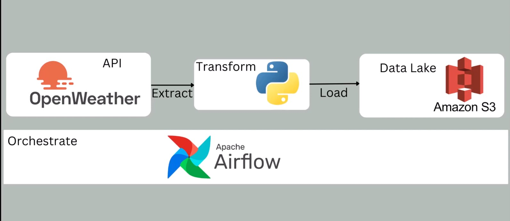
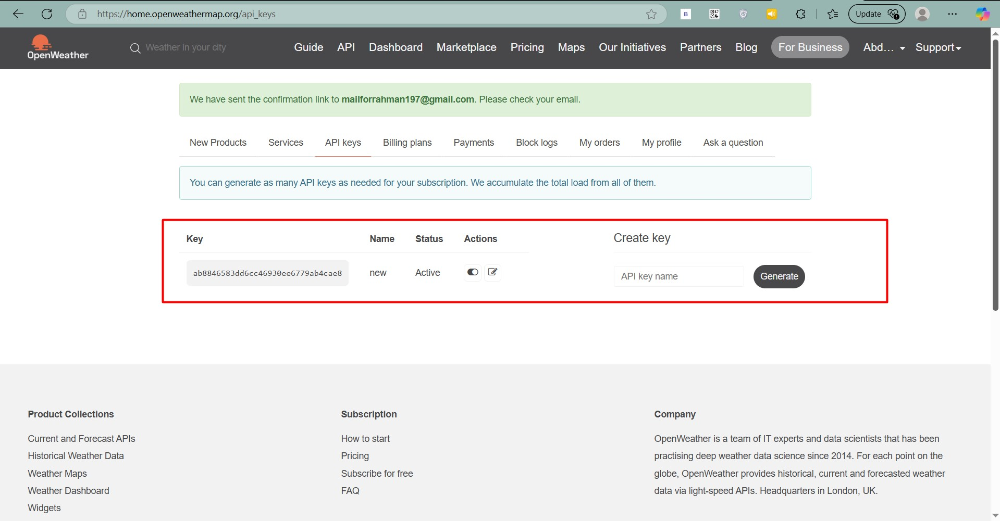
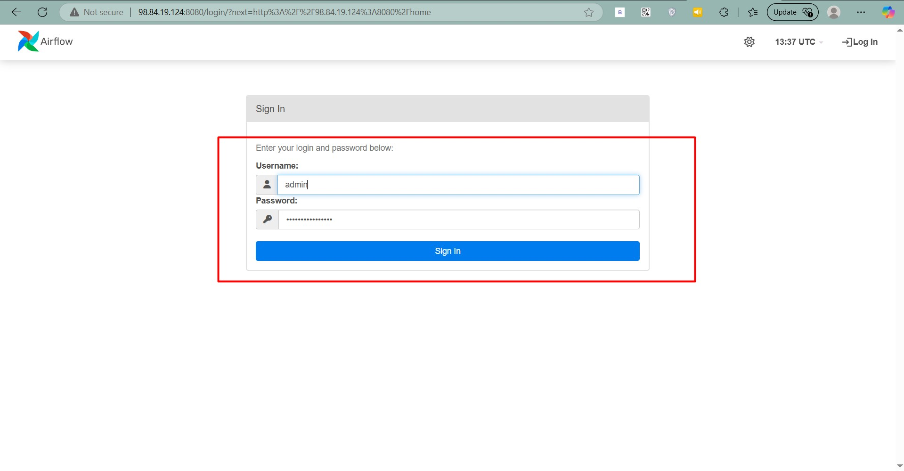
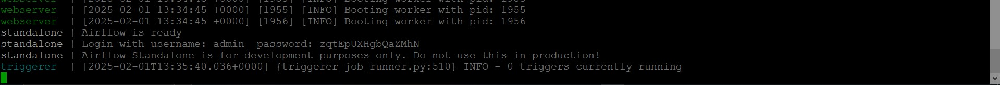
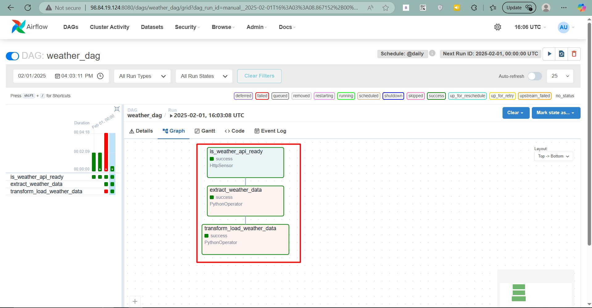
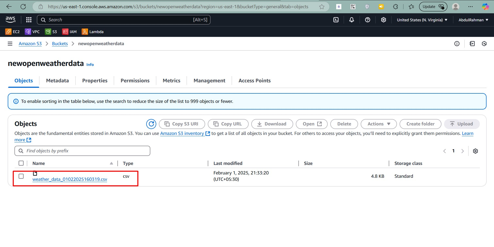
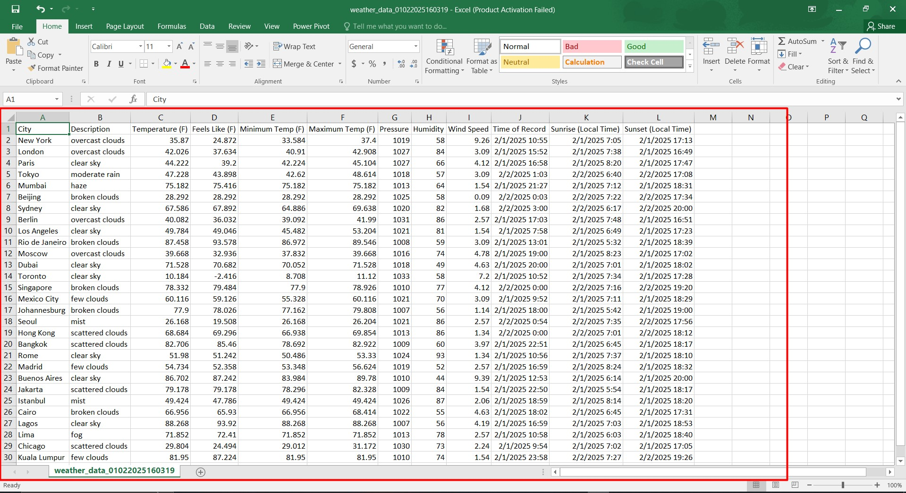

# Automated Global Weather Data Pipeline with Airflow and AWS S3

This repository demonstrates how to build an **automated weather data pipeline** using **Apache Airflow** to extract data from the OpenWeatherMap API and store it in an **AWS S3 bucket** for further analysis. The pipeline retrieves weather data for various global locations on a daily basis.



---

## 🛠 Prerequisites

Before you begin, ensure you have the following:

1. **AWS Account**: Create an S3 bucket for storing the weather data.
2. **OpenWeatherMap API Key**: Sign up at [OpenWeatherMap](https://openweathermap.org/api) to get your API key.
3. **Python Environment**: Install Python 3.7+.
4. **Apache Airflow**: Install and configure Apache Airflow on your local machine or server.
5. **Boto3**: Python SDK for AWS services.

---

## 🚀 Getting Started

### 1. Clone the Repository
```bash
git clone https://github.com/Abd-al-RahmanH/Automated-Global-Weather-Data-Pipeline-with-Airflow-aws-S3.git
cd Automated-Global-Weather-Data-Pipeline-with-Airflow-aws-S3
```

### 2. Install Required Python Libraries

Create a virtual environment and install dependencies:
```bash
python3 -m venv venv
source venv/bin/activate
pip install -r requirements.txt
```

### 3. Configure Environment Variables

Before running the DAG, update the `.py` file with your credentials:

1. Replace `AWS_ACCESS_KEY` and `AWS_SECRET_ACCESS_KEY` with your actual **AWS credentials**.
2. Replace `OPENWEATHER_API_KEY` with your valid **OpenWeatherMap API key**.


3. Create an S3 bucket and replace `S3_BUCKET` with its name.

Example configuration in the Python script:
```python
AWS_CREDENTIALS = {
    "key": "your_access_key",
    "secret": "your_secret_access_key"
}

API_KEY = "your_openweather_api_key"

S3_BUCKET = "your_s3_bucket_name"
```

### 4. Start Apache Airflow

Start Airflow using the standalone command:
```bash
airflow standalone
```

Access the Airflow UI at `http://localhost:8080`.



The user and password will displayed in terminal



### 5. Deploy the DAG

1. Place the DAG file (`weather_dag.py`) in the `dags` folder of your Airflow home directory.
2. Refresh the Airflow UI to see the DAG.


3. Trigger the DAG manually or schedule till u see success.



4. Finally You can get the data from s3 bucket.






---

## 📂 Project Structure
```plaintext
.
├── dags
│   └── weather_data_pipeline.py  # Airflow DAG definition
├── data
│   └── sample_output.json         # Example output data
├── requirements.txt               # Python dependencies
└── README.md                      # Project documentation
```

---

## 🔑 Notes

- Ensure the Airflow instance has access to the internet to connect to OpenWeatherMap API and AWS S3.
- Validate your AWS IAM permissions to allow writing to the S3 bucket.

---